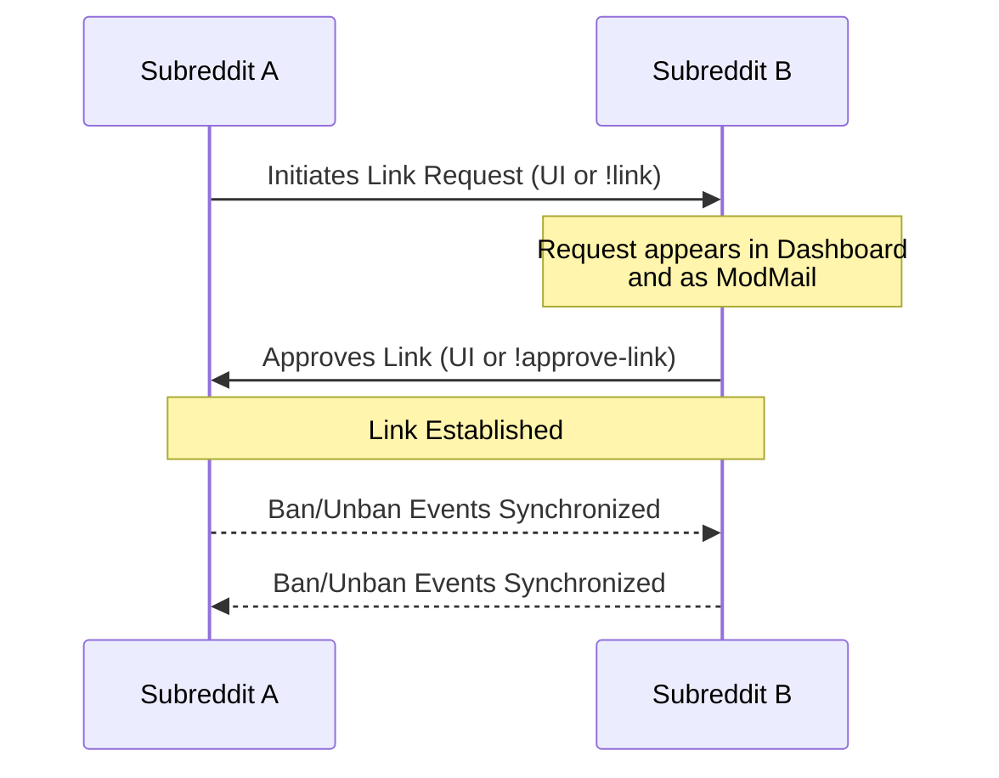
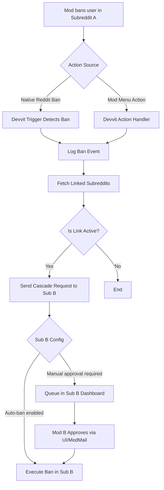
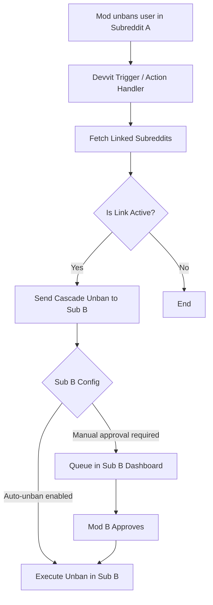

# Cascade Ban

*(Click the image below to play the demo video)*<br/>
[](https://www.youtube.com/watch?v=L9yDxKsjcrI)

> **Synchronize ban and unban decisions across a cluster of allied subreddits natively in Devvit.**

Cascade Ban is a powerful moderation tool designed for communities that work together. It allows a network of subreddits to seamlessly share bans and unbans, reducing the administrative burden on moderators while keeping bad actors out. 

It supports the existing ModMail command workflow, native Reddit ban/unban actions, and a custom-post dashboard for reviewing links and pending cascade requests from a unified UI.

---

## 📸 Screenshots & Workflow

### Full UI Dashboard


### Mod Menu Integration


### Dashboard Access Point


### Subreddit Links Management


### Mod Note Integration


### Banned User Example


### ModMail Communication


### Audit Logs


---

## ✨ Features

- **Dashboard Post**: Open a private CascadeBan dashboard from the subreddit menu to manage links, pending ban/unban requests, failures, and recent activity.
- **Cluster Linking**: Request, approve, pause, or reactivate subreddit links from the dashboard. ModMail commands (`!link r/Subreddit`, `!approve-link r/Subreddit`) continue to work.
- **Native Reddit Ban Support**: Bans and unbans performed through Reddit's normal moderator UI create dashboard-visible cascade requests for linked subreddits.
- **ModMail Approval Flow**: Linked subreddits still receive ModMail requests and can approve with `!approve-ban u/username` or `!approve-unban u/username`.
- **Cross-Subreddit UI Actions**: Use the post/comment menu to ban a user or add mod notes across the current subreddit and approved linked subreddits.
- **Audit Trail**: Dashboard activity records link changes, request approvals, rejections, applied actions, and failures.

---

## 🏗️ Architecture & Workflows

### 1. Linking Handshake
This workflow demonstrates how two subreddits establish a connection to share ban/unban requests.



### 2. Cascade Ban Workflow
When a moderator bans a user in one subreddit, the action propagates to allied subreddits.



### 3. Cascade Unban Workflow
Similarly, unbanning a user propagates the reversal to the linked subreddits.



---

## 🚀 Local Setup & Development

To run this app locally in your own testing subreddit:

1. **Install Dependencies**:
   ```bash
   npm install
   ```
2. **Install Devvit CLI**:
   ```bash
   npm install -g @devvit/cli
   ```
3. **Login to Devvit**:
   ```bash
   devvit login
   ```
4. **Playtest**:
   ```bash
   devvit playtest
   ```

---

## ⚙️ App Settings

After installing, configure the following options in the app's settings:

- **Default Ban Subreddits**: Subreddits to ban from by default via the UI.
- **Default Mod Note Subreddits**: Subreddits to receive mod notes by default via the UI.
- **Default Mod Note Label**: Label used when adding manual mod notes.
- **Default User Message**: Message sent to users when banned. Supports placeholders: `{{author}}`, `{{subreddit}}`, `{{kind}}`, `{{originSubreddit}}`, `{{url}}`, and `{{actioningMod}}`.

---

## 🛠️ Commands

Moderators can use the following commands in ModMail to manage the cascade network:
- `!link r/Subreddit`: Propose a link to another subreddit.
- `!approve-link r/Subreddit`: Approve a pending link request.
- `!approve-ban u/username`: Approve a cascade ban request triggered by an allied subreddit.
- `!approve-unban u/username`: Approve a cascade unban request triggered by an allied subreddit.
